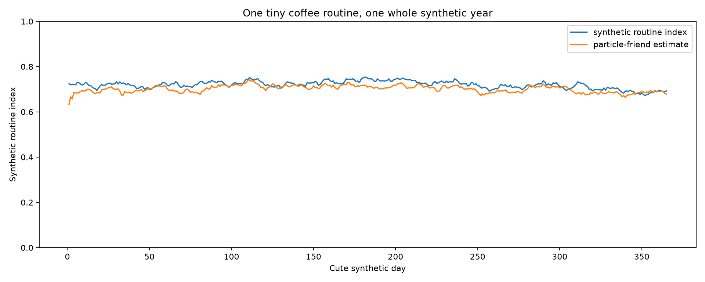

# Coffee Routine Model ☕🐾✨

A tiny coffee routine with suspiciously serious math.

> **Humans are not state machines.**  
> The model is allowed to be uncertain. Humans are allowed to surprise it. XD

## Start with the story 📖☕

Meet **Cheng** and **Linda** — synthetic story personas used only to make the model readable.
They are example characters here, not a published private transcript or ground-truth psychology dataset.

A tiny week might look like this:

```text
Monday
Cheng: +1?
Linda: 要
coffee arrives ☕
Linda: 👍

Tuesday
Cheng: +1?
Linda: pass

Wednesday
busy morning, slower reply 🌧️

Thursday
leave / pause 🏖️

Friday
resume 🌱

Next Monday
ordinary coffee again ☕
```

Nothing in that story tells us somebody's hidden internal truth.
It only gives us observable little events.

So the first translation is:

```text
Cheng asks +1?     -> invite
Linda says 要      -> opt_in
coffee arrives     -> routine_maintenance
Linda reacts 👍    -> reaction
pass               -> pass_event
state update       -> proactive_update
resume             -> resume_signal
```

Then the names come off.

```text
Cheng / Linda story
        ↓
Persona / Protocol Adapter
        ↓
Generic actions + observations
        ↓
CSRDM Core
```

**Story at the edge. Generic math in the center.** ☕🧠

The runnable synthetic persona example lives in [`examples/cheng_linda_story.py`](examples/cheng_linda_story.py).

## Six soft questions, not six mind-reading meters 🧠🌱

The hidden state is:

```text
x(t) = [P, M, V, C, E, F]
```

| State | Story intuition | Model meaning |
|---|---|---|
| `P` | Does the little routine usually behave in ways that are easy to anticipate? | Predictability |
| `M` | Are both sides still helping the loop exist, even if their contributions are different? | Mutuality |
| `V` | Can somebody freely say `pass` without the model treating it as failure? | Voluntariness |
| `C` | Do callbacks, little rules, repeated coordination, and shared language accumulate over time? | Shared Context |
| `E` | Do ordinary states like busy / tired / okay enter the observable interaction? | Everyday State Sharing |
| `F` | Is coordination becoming costly, awkward, or difficult? | Friction |

A useful example is `C`.

One callback is just one callback. A long stream of remembered little patterns can become accumulated context, so `C` has its own slow memory law:

\[
C_{t+1}=C_t+\eta I_t(1-C_t)-\lambda C_t+w_t^C
\]

Memory is not mood. One quiet day does not erase history. 🧠🌱

## Five kinds of tiny weather 🌦️🎲

The routine also has a discrete mode:

```text
☕ Normal
🌧️ Busy
🏖️ Leave
🎂 Special
🌱 Recovery
```

A timeline might be:

```text
Normal → Busy → Leave → Leave → Recovery → Normal
```

The model does **not** see one Leave day and declare the universe broken. XD

Mode transitions remain stochastic:

\[
p(m_{t+1}\mid m_t,x_t,a_t,d_t)
\]

Context may nudge the dice. It does not deterministically choose the answer.

## Tiny particle friends 🐣🐣🐣

Suppose the model sees one quiet day.

Different particles can tell different little hypotheses:

```text
🐣 #1  "Probably ordinary noise."
🐣 #2  "Maybe today is Busy."
🐣 #3  "Maybe friction is a bit higher."
🐣 #4  "Maybe nothing structural changed at all."
```

Then another clue arrives — perhaps a normal `resume` and ordinary coffee.

Some hypotheses become more plausible. Others lose weight.

That is the intuition behind the Particle Filter:

\[
p(x_t,m_t\mid z_{1:t})
\]

Later evidence may also help historical uncertainty through smoothing:

\[
p(x_t,m_t\mid z_{1:T})
\]

Later evidence can update uncertainty. It does not rewrite observed facts. 🔭🐣

## Now the engineering shape 🏛️☕

Architecture **`0.3`** keeps one stable public door:

```python
from coffee_brain import CSRDM, CSRDMConfig

brain = CSRDM(CSRDMConfig())
result = brain.step(["+1?", "要", "☕", "👍"])

print(result.posterior.mean)
```

The controlled stochastic model is conceptually:

\[
x_{t+1}\sim p(x_{t+1}\mid x_t,m_t,a_t,d_t)
\]

\[
z_t\sim p(z_t\mid x_t,m_t)
\]

where:

```text
x_t = latent continuous state [P M V C E F]
m_t = latent routine mode
a_t = observable action basket
d_t = explicit known disturbance / regime context
z_t = observable clue basket
```

The full architecture contract lives in [`docs/architecture.md`](docs/architecture.md).

## Tiny protocol bridge ☕➡️🧠

The companion [`coffee-routine-protocol`](https://github.com/cctsao1008/coffee-routine-protocol) speaks tiny coffee language:

```text
+1?
+
要
對
👍
pass
☕
resume
```

`coffee_brain/protocol_adapter.py` keeps observable actions and observation clues separate.
Missing facts stay `None`; ambiguous tokens stay ambiguous.

Even `👍` is contextual:

```text
after +1?  -> may be opt-in
after ☕   -> may be reaction
alone      -> may stay ambiguous
```

```text
Protocol event != latent state
Action != intention
Observation != internal truth
```

Bridge details live in [`docs/tiny-protocol-bridge.md`](docs/tiny-protocol-bridge.md).

## Persona layer: cute costume, removable math 🎭☕

The story layer deliberately lives in `examples/`, not `coffee_brain/`.

```python
from examples.cheng_linda_story import ChengLindaBeat, to_generic_step

step = to_generic_step(
    ChengLindaBeat(
        cheng_invite=True,
        linda_choice="要",
        cheng_delivery=True,
        linda_reaction="👍",
    )
)

print(step.actions)
print(step.observation)
```

The output uses only generic fields such as:

```text
invite
opt_in
reaction
routine_maintenance
```

So the repo gets a story without hard-coding a specific pair of people into the mathematical core. XD

## What the tiny brain can do 🧠🧰

The architecture now includes:

```text
protocol / persona adaptation
controlled six-state dynamics
hybrid modes
Shared Context memory
Particle Filtering
Particle Smoothing
recovery / resilience measurement
observability diagnostics
calibration
change-point detection
context-aware transitions
sensitivity mapping
state-redundancy tests
bounded parameter learning
model-comparison arena
experiment fingerprints
```

That is enough machinery. New algorithms are not the default anymore.

## Synthetic coffee weather 🌦️☕

The simulator intentionally does not always use the estimator's assumptions:

```text
Synthetic World != Estimator Assumptions
```

Available worlds:

```text
🌤️ cozy-normal-year
🌧️ super-busy-month
🏖️ long-leave-and-return
💤 sleepy-reply-season
🎂 special-day-sparkle
🌪️ noisy-chaos-week
🌱 slow-recovery
```

Run one:

```bash
python -m tiny_tools.simulate --scenario slow-recovery --days 365
```

## 365 cute days 🗓️☕

The committed reference basket is:

```text
examples/365-cute-days/
├── README.md
├── input.csv
├── output.csv
├── metrics.csv
└── tiny-year-summary.png + state/mode figures
```

Reference highlights for the committed synthetic baseline:

```text
relationship-index RMSE : 0.0185
relationship-index MAE  : 0.0135
relationship-index r    : 0.805
mode accuracy            : 82.2%
```

These numbers validate a synthetic architecture exercise. They do **not** prove that real people follow these equations.

Paint the year again:

```bash
python -m tiny_tools.visualize examples/365-cute-days/output.csv
```



## Run the little brain ☕➡️🐣

```bash
python -m pip install -r requirements.txt
python -m tiny_tools.simulate
python -m tiny_tools.visualize examples/365-cute-days/output.csv
```

Want a short scratch run without committing a historical demo basket?

```bash
python -m tiny_tools.simulate --days 100 --out .tiny-100-day-scratch
```

## Test nest 🐣✅

```bash
python -m pip install -r requirements-dev.txt
python -m pytest -q
```

CI also exercises observability, sensitivity, redundancy, recovery, smoothing, memory, calibration, change points, transitions, and a small chaos simulation.

```text
Cute CI != weak CI.
```

## Pick your reading path 📚✨

```text
☕ Curious human
   README story → six states → five modes → tiny particles

🛠️ Software engineer
   public CSRDM API → config → protocol adapter → experiment contract

🧠 Math / control reader
   docs/architecture.md → dynamics → observation model → PF / smoothing → diagnostics
```

Same model. Different doors.

## House rules ☕🌸

The full tiny constitution lives in [`CUTE_RULES.md`](CUTE_RULES.md).
The history book lives in [`COFFEELOG.md`](COFFEELOG.md).

Two especially important rules:

> **Cute != sloppy.**

> **Hard math should still tell a little story. ☕📖🐣**

And the guardrails:

```text
Story != evidence
Persona != core ontology
Observed behavior != internal truth
Continuity != obligation
Pass != failure
Disturbance != rupture
Sensitivity != causality
Model != human
```

Cute outside. Cute inside. Math still works. ☕🐣🧠
