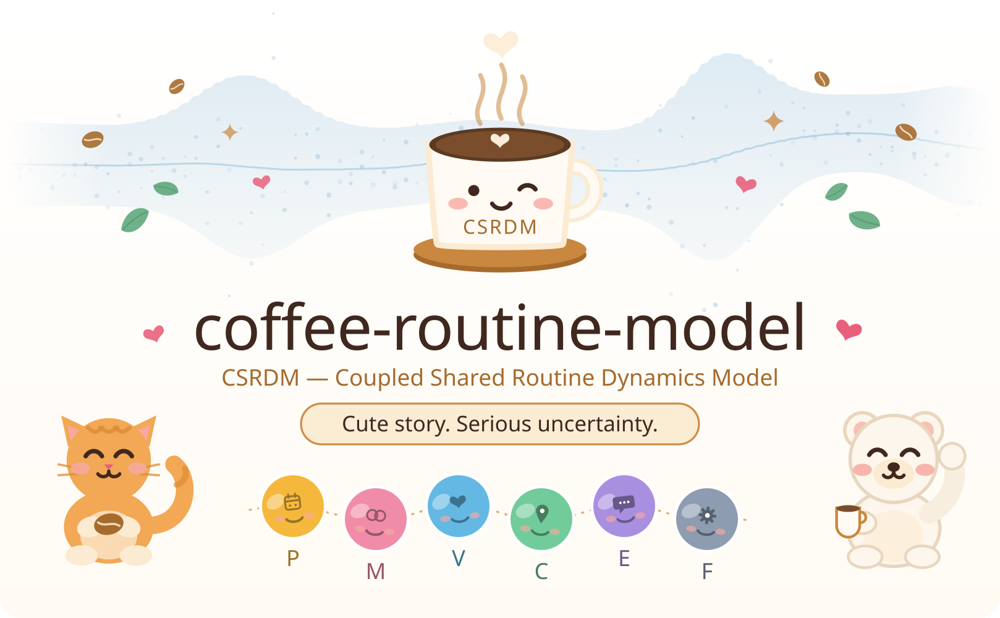

# Coffee Routine Model ☕🐾✨

<p align="center">
  
</p>

A tiny coffee routine with suspiciously serious math.

> **Humans are not state machines.**

Some routines are small enough to look trivial from the outside: one message, one coffee, one reply. But repetition creates context. People get busy, pass, return, forget, resume, and sometimes simply have an ordinary day.

That is where this project begins.

```text
A tiny routine became a modeling question.

Not:
“How do we model a person?”

But:
“How do we describe a shared routine when observations are incomplete,
interruptions happen, and uncertainty should stay visible?”
```

This project starts with observable routine events and gradually turns them into a stochastic model — while keeping uncertainty, assumptions, and unknowns visible.

```text
story
→ observation
→ modeling question
→ hidden state
→ inference
→ diagnostics
```

There is only **one model here**. You choose how deep you want to read.

### What this project refuses to do 🌿

```text
✗ read minds
✗ score people
✗ decide what a relationship means
✗ turn probability into fact

✓ model a routine under uncertainty
```

The people in a routine still matter because routines are lived, not generated by equations. The model simply refuses to pretend that private meaning is directly observable.

## What is this useful for? ☕🧭

CSRDM is a small research and engineering sandbox for recurring voluntary routines where observations are incomplete, context accumulates, interruptions happen, and uncertainty should remain visible.

Coffee is the reference domain because it keeps the model concrete and easy to inspect. The same modeling pattern could also be explored for:

- **recurring team check-ins**;
- **shared household routines**;
- **study / practice rituals**.

These are adaptation directions, not validated generalization claims.

```text
Possible adaptation != validated generalization
Modeling a routine != modeling a person
Posterior estimate != human truth
```

## Choose a path 🪜☕

```text
I just want the idea
→ README → Glossary → Starter Math

I want to use it
→ README → Public API → examples/

I want to inspect the model
→ Architecture → Full Math → diagnostics
```

Quick doors:

- [`Glossary`](docs/glossary.md) — project vocabulary;
- [`Common Confusions`](docs/common-confusions.md) — recurring category mistakes;
- [`Tutorial`](docs/tutorial/README.md) — guided design story;
- [`Starter Math`](docs/math/starter-math.md) — readable mathematical entry point;
- [`Full Math`](docs/math/full-math.md) — complete stochastic model;
- [`Public API`](docs/public-api.md) — safe calling rules;
- [`Architecture`](docs/architecture.md) — software/config contract;
- [`Documentation map`](docs/README.md) — everything else.

> **Same model. Same example. Different depth.**

## 1. Start with one tiny routine 📖☕

Meet **Cheng** and **Linda** — synthetic teaching personas used only to make the examples easier to follow.

There is no dramatic event hiding in this example. That is part of the point. A shared routine can become familiar, useful, and worth modeling without every ordinary moment needing a secret explanation.

```text
Monday
Cheng: +1?
Linda: 要
coffee arrives ☕
Linda: 👍

Tuesday
Cheng: +1?
Linda: pass

Wednesday
busy morning 🌧️

Thursday
leave / pause 🏖️

Friday
resume 🌱
```

The coffee is simple. The surrounding routine is where timing, choice, interruption, memory, and uncertainty begin to appear.

The public story is illustrative, not a private transcript and not a ground-truth psychology dataset.

```text
Story != evidence
```

## 2. What can we actually observe? 👀

The model starts from behavior-level events:

```text
+1?      → invite
要        → opt_in
pass     → pass_event
☕        → routine_maintenance
👍        → reaction, depending on context
busy     → observable update when explicitly provided
resume   → resume_signal
```

Those events do **not** directly reveal intention or hidden meaning.

```text
Observed event != internal truth
Action != intention
Missing clue != zero
```

The companion [`coffee-routine-protocol`](https://github.com/cctsao1008/coffee-routine-protocol) provides the tiny interaction vocabulary. The protocol adapter turns that vocabulary into generic model fields before the math begins.

## 3. Why is counting coffee not enough? 🧩

A simple counter cannot distinguish:

```text
voluntary pass
busy interruption
leave
ordinary return
shared context that accumulated over time
coordination that becomes easier or harder
```

That creates the modeling questions:

```text
Can the routine become predictable?
Can both sides contribute differently?
Can pass stay a valid choice?
Can context accumulate?
Can ordinary state updates matter?
Can friction change over time?
```

## 4. CSRDM appears ☕🧠

**Coupled Shared Routine Dynamics Model (CSRDM)** is the model that answers those questions probabilistically.

```text
Coupled        → both sides can affect the routine
Shared Routine → the routine itself is the modeling object
Dynamics       → it can change over time
Model          → it remains an uncertain abstraction
```

The six soft hidden states are:

```text
P = Predictability
M = Mutuality
V = Voluntariness
C = Shared Context
E = Everyday State Sharing
F = Friction
```

Together:

```text
x_t = [P, M, V, C, E, F]
```

Read `x_t` as the hidden routine-state vector at time `t`.
These are model variables, not six meters attached to a person.

Three boundaries matter immediately:

```text
Mutuality != 50/50 symmetry
Pass != failure
Probability != fact
```

## 5. How are the hidden states estimated? 🐣🔍

Hidden states cannot be observed directly, so CSRDM uses a **Particle Filter** — a Sequential Monte Carlo estimator that keeps many weighted candidate hidden states and updates their plausibility when new observations arrive.

The resulting **posterior** is the model's probability distribution over what remains plausible after seeing the available evidence.

```text
observable events
      ↓
protocol adapter
      ↓
actions + observation clues
      ↓
CSRDM hidden-state dynamics
      ↓
Particle Filter
      ↓
posterior uncertainty
      ↓
optional smoothing + diagnostics
```

For equations and implementation boundaries:

- [`Starter Math`](docs/math/starter-math.md) — variables and main relationships;
- [`Full Math`](docs/math/full-math.md) — complete stochastic hybrid model;
- [`Architecture`](docs/architecture.md) — software/config/public contract.

## 6. Run the tiny brain ☕➡️🐣

Install from the repository root:

```bash
python -m pip install .
```

Then run one observable coffee moment through the stable public API:

```python
from coffee_brain import CSRDM, CSRDMConfig

brain = CSRDM(CSRDMConfig())
result = brain.step(["+1?", "要", "☕", "👍"])

print({name: round(value, 3) for name, value in result.mean_by_state.items()})
print(result.posterior.mode)
```

With the default seed used by this example, that prints:

```text
{'predictability': 0.692, 'mutuality': 0.602, 'voluntariness': 0.805, 'shared_context': 0.587, 'state_sharing': 0.284, 'friction': 0.212}
Normal
```

One step, one posterior. Those numbers are **posterior means over the particle cloud**, not measurements of a person.

Raw arrays remain available under `result.posterior`; named views keep the ordinary path readable. For missing-data rules, action timing, smoothing, context-aware transitions, and input validation, see [`docs/public-api.md`](docs/public-api.md).

For longer reproducible runs:

```bash
python -m tiny_tools.simulate --scenario slow-recovery --days 365
python -m tiny_tools.controlled_reference
```

The observation-only reference lives in [`examples/365-cute-days/`](examples/365-cute-days/); the known-action result summary lives in [`docs/controlled-reference-result.md`](docs/controlled-reference-result.md).

```text
Synthetic reference != real-human validation
Synthetic World != Estimator Assumptions
```

## 7. What did the diagnostics actually find? 🔬

The repository does not only report successful runs. Some of the most useful diagnostics start from a mismatch and ask what caused it.

Three metric names used below:

```text
95% coverage
→ fraction of evaluated synthetic-truth points inside the reported 95% posterior interval

amplitude ratio
→ estimated-state standard deviation / synthetic-truth standard deviation
→ 1.0 means equal variation amplitude

MSE
→ mean squared error
```

### Voluntariness (`V`) compression 🌿

**Baseline — V-only with the default prior**

```text
amplitude ratio = 0.201
95% coverage    = 47.2%
```

**Diagnostic comparator — deliberately relaxed V prior**

```text
amplitude ratio = 0.900
95% coverage    = 95.6%
```

**What the test supports:** in this synthetic stress test, the default V dynamics prior is the strongest identified limiter; cross-state aliasing is secondary.

See [`V Posterior Compression Result`](docs/v-compression-result.md) for the full receipt.

### Shared Context (`C`) bias 🧠🌱

**Baseline**

```text
95% coverage       = 57.8%
offset MSE fraction = 0.8976
```

**Diagnostic comparator — matched starting center only**

```text
95% coverage = 92.6%
```

**What the test supports:** initialization mismatch plus slow memory explain most of the default offset, but not every later error.

See [`Shared Context Bias Decomposition`](docs/shared-context-bias-result.md) for the full receipt.

These results are deliberately narrower than a production recommendation.

```text
Diagnostic improvement != production recommendation
Better fit != better ontology
Synthetic result != real-human validation
```

Other focused labs cover observability, calibration, sensitivity, change points, recovery, smoothing, model comparison, and state sufficiency. Start from the [`documentation map`](docs/README.md) if you want the full trail.

## 8. Boundaries and house rules ⚖️☕

The repo-wide claim vocabulary is:

```text
Observed
Probable
Assumed
Undefined
Not-yet-decided
```

Some wider boundaries belong here rather than inside the six-state introduction:

```text
Continuity != obligation
High historical probability != future commitment
Cute != sloppy
Plain language != missing rigor
Model != human
```

See [`docs/epistemic-status.md`](docs/epistemic-status.md).
For compact definitions, use the [`Glossary`](docs/glossary.md).
For recurring category mistakes, use [`Common Confusions`](docs/common-confusions.md).

The public story contract lives in [`docs/objective-story-contract.md`](docs/objective-story-contract.md).
The distilled design principles live in [`docs/design-principles.md`](docs/design-principles.md).
The tiny constitution lives in [`CUTE_RULES.md`](CUTE_RULES.md).

And yes: `XD` is still seasoning, not punctuation. ☕

## 9. Documentation principle 📝

> **README explains the system. Issues explain the journey. Code proves the current state.**

README and durable documentation explain the model, assumptions, mathematics, public contracts, interpretation boundaries, and reproducible evidence. GitHub Issues preserve experiments, evolving hypotheses, temporary limitations, implementation work, and closure conclusions. Code, configuration, tests, and generated evidence remain the authoritative proof of executable behavior.

## 10. Test nest and license 🐣✅📜

```bash
python -m pip install -r requirements-dev.txt
python -m pytest -q
```

CI exercises the public model, adapters, diagnostics, memory, smoothing, calibration, change points, controlled reference, synthetic runs, and an installed-package smoke test from outside the source tree.

Coffee, code, and tiny particles are shared under the **MIT License**.
See [`LICENSE`](LICENSE) for the full legal text.

One tiny routine. Many levels of depth. Same mathematical skeleton. ☕🌱📐🐣
