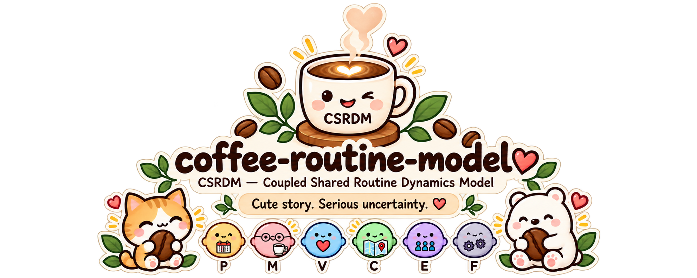

# Coffee Routine Model ☕🐾✨

<p align="center">
  
</p>

A tiny coffee routine with suspiciously serious math.

> **Humans are not state machines.**

This project starts with observable routine events and gradually turns them into a stochastic model — while keeping uncertainty, assumptions, and unknowns visible.

```text
story
→ observation
→ modeling question
→ hidden state
→ probability
→ inference
→ diagnostics
```

There is only **one Coupled Shared Routine Dynamics Model (CSRDM)**. You can simply choose how deep you want to read.

## Five-minute path 🪜☕

If you only have a few minutes, use this route:

```text
1. What is CSRDM?                    → Read “CSRDM appears” below
2. What are P / M / V / C / E / F? → docs/glossary.md
3. How does inference work?          → docs/math/starter-math.md
4. How do I run it?                  → docs/public-api.md
5. What should I not conclude?       → docs/epistemic-status.md + docs/common-confusions.md
```

Or choose by intent:

```text
I just want the idea
→ README → Glossary → Starter Math

I want to use it
→ README → Public API → examples/

I want to inspect the model
→ Architecture → Full Math → diagnostics
```

```text
Five-minute path != simplified model
Fewer reading decisions != fewer model boundaries
```

## 1. Start with one tiny routine 📖☕

Meet **Cheng** and **Linda** — synthetic teaching personas used only to make the examples easier to follow.

```text
Monday
Cheng: +1?
Linda: 要
coffee arrives ☕
Linda: 👍

Tuesday
Cheng: +1?
Linda: pass

Wednesday
busy morning 🌧️

Thursday
leave / pause 🏖️

Friday
resume 🌱
```

The public story is illustrative, not a private transcript and not a ground-truth psychology dataset.

```text
Story != evidence
Persona != core ontology
```

## 2. What can we actually observe? 👀

The model starts from behavior-level events:

```text
+1?      → invite
要        → opt_in
pass     → pass_event
☕        → routine_maintenance
👍        → reaction, depending on context
busy     → observable update when explicitly provided
resume   → resume_signal
```

Those events do **not** directly reveal intention or hidden meaning.

```text
Observed event != internal truth
Action != intention
Missing clue != zero
```

The companion [`coffee-routine-protocol`](https://github.com/cctsao1008/coffee-routine-protocol) provides the tiny interaction vocabulary. The protocol adapter turns that vocabulary into generic model fields before the math begins.

## 3. Why is counting coffee not enough? 🧩

A simple counter cannot distinguish:

```text
voluntary pass
busy interruption
leave
ordinary return
shared context that accumulated over time
coordination that becomes easier or harder
```

That creates the modeling questions.

```text
Can the routine become predictable?
Can both sides contribute differently?
Can pass stay a valid choice?
Can context accumulate?
Can ordinary state updates matter?
Can friction change over time?
```

## 4. CSRDM appears ☕🧠

**CSRDM** means **Coupled Shared Routine Dynamics Model**.

```text
Coupled        → both sides can affect the routine
Shared Routine → the routine itself is the modeling object
Dynamics       → it can change over time
Model          → it remains an uncertain abstraction
```

The six soft hidden states are:

```text
P = Predictability
M = Mutuality
V = Voluntariness
C = Shared Context
E = Everyday State Sharing
F = Friction
```

Together:

```text
x_t = [P, M, V, C, E, F]
```

These are model variables, not six meters attached to a person.

Useful boundaries:

```text
Mutuality != 50/50 symmetry
Continuity != obligation
Pass != failure
Disturbance != rupture
Probability != fact
Undefined relationship != zero relationship
High historical probability != future commitment
```

## 5. Choose how deep you want to go 🪜☕

You do not need to read the whole repo at one mathematical level.

```text
📚 I just need the project vocabulary
→ docs/glossary.md

❓ I keep wondering “does this mean...?”
→ docs/common-confusions.md

☕ Just tell me the story
→ docs/how-the-coffee-works.md

📖 Show me how the model was designed
→ docs/tutorial/README.md

🌱 Show me the Starter Math
→ docs/math/starter-math.md

📐 Show me the Full Math
→ docs/math/full-math.md

🛠️ Show me how to call the public API safely
→ docs/public-api.md

🏛️ Show me the software architecture
→ docs/architecture.md

🐣 Show me how hidden state is estimated
→ docs/tutorial/08-why-particles.md
→ docs/smoothing-garden.md

🔬 Show me how the model challenges itself
→ docs/observability-garden.md
→ docs/calibration-bench.md
→ docs/model-arena.md
```

The key idea is:

> **Same model. Same example. Different depth.**

`Starter Math` is a readable projection of the full model. It is not a separate Lite model.
The [`Glossary`](docs/glossary.md) is a lookup map, not a second specification.

## 6. Run the tiny brain ☕➡️🐣

The stable public API stays small:

```python
from coffee_brain import CSRDM, CSRDMConfig

brain = CSRDM(CSRDMConfig())
result = brain.step(["+1?", "要", "☕", "👍"])

print(result.mean_by_state)
print(result.posterior.mode)
```

Raw arrays remain available under `result.posterior`; the named views keep the ordinary path readable.
For missing-data rules, action timing, smoothing, context-aware transitions, and input validation, see [`docs/public-api.md`](docs/public-api.md).

Install the package from the repository root:

```bash
python -m pip install .
```

The current package snapshot is `0.3.1`; the CSRDM architecture remains `0.3`.
The earlier `v0.3.0` tag marks the architecture-complete baseline and stays fixed as historical provenance.
A packaging patch release does not silently relabel the mathematical architecture.

For repo-local tooling and CI, `requirements.txt` remains a readable mirror of the runtime dependencies declared in `pyproject.toml`:

```bash
python -m pip install -r requirements.txt
```

Run a synthetic world:

```bash
python -m tiny_tools.simulate --scenario slow-recovery --days 365
```

The committed observation-only reference lives in [`examples/365-cute-days/`](examples/365-cute-days/).
The separate known-action reference is generated on demand:

```bash
python -m tiny_tools.controlled_reference
```

Its committed result summary lives in [`docs/controlled-reference-result.md`](docs/controlled-reference-result.md).

```text
Synthetic reference != real-human validation
Synthetic World != Estimator Assumptions
```

## 7. What happens behind the small API? 🧠

At a high level:

```text
observable events
      ↓
protocol adapter
      ↓
actions + observation clues
      ↓
CSRDM hidden-state dynamics
      ↓
Particle Filter
      ↓
posterior uncertainty
      ↓
optional smoothing + diagnostics
```

If you want equations, use the math doors instead of making this README carry the whole textbook:

- [`Starter Math`](docs/math/starter-math.md) — variables and main relationships;
- [`Full Math`](docs/math/full-math.md) — complete stochastic hybrid model;
- [`Architecture`](docs/architecture.md) — software/config/public contract.

## 8. How does the model challenge itself? 🔍🧪

The repo includes focused labs for questions such as:

```text
Can the clues distinguish the states?
Are probability outputs calibrated?
Which assumptions matter most?
Does one strange day really imply a persistent change?
Can the model recover after interruption?
Can a simpler model compete?
```

The important rule is not “make the score prettier.”

```text
Better fit != better ontology
Estimable != identifiable
Winner != truth
Synthetic success != real-human truth
```

The documentation map lives in [`docs/README.md`](docs/README.md).

## 9. Boundaries and house rules ⚖️☕

The repo-wide claim vocabulary is:

```text
Observed
Probable
Assumed
Undefined
Not-yet-decided
```

See [`docs/epistemic-status.md`](docs/epistemic-status.md).
For compact definitions of recurring project terms, use [`docs/glossary.md`](docs/glossary.md).
For the most common category mistakes, use [`docs/common-confusions.md`](docs/common-confusions.md).

The public story contract lives in [`docs/objective-story-contract.md`](docs/objective-story-contract.md).
The distilled design principles live in [`docs/design-principles.md`](docs/design-principles.md).
The tiny constitution lives in [`CUTE_RULES.md`](CUTE_RULES.md).

```text
Cute != sloppy
Simple != false
Plain language != missing rigor
Story != evidence
Model != human
```

And yes: `XD` is still seasoning, not punctuation. ☕

## 10. Test nest 🐣✅

```bash
python -m pip install -r requirements-dev.txt
python -m pytest -q
```

CI exercises the public model, adapters, diagnostics, memory, smoothing, calibration, change points, controlled reference, synthetic runs, and an installed-package smoke test from outside the source tree.

```text
Cute CI != weak CI
```

## 11. License 📜☕

Coffee, code, and tiny particles are shared under the **MIT License**.
See [`LICENSE`](LICENSE) for the full legal text.

```text
Cute license note != replacement for LICENSE
```

One tiny routine. Many levels of depth. Same mathematical skeleton. ☕🌱📐🐣
